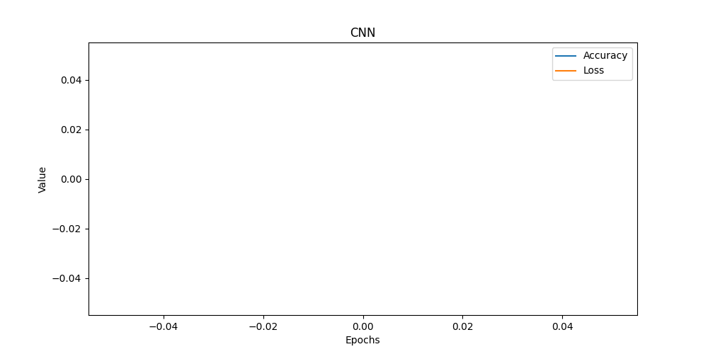
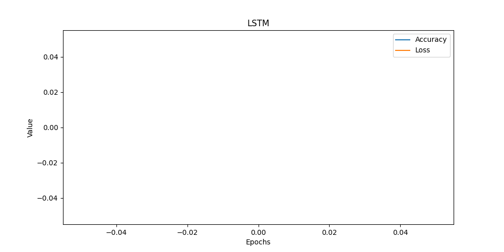
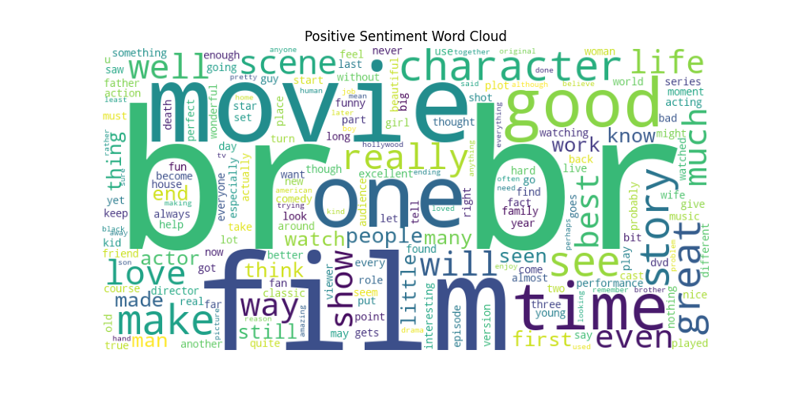
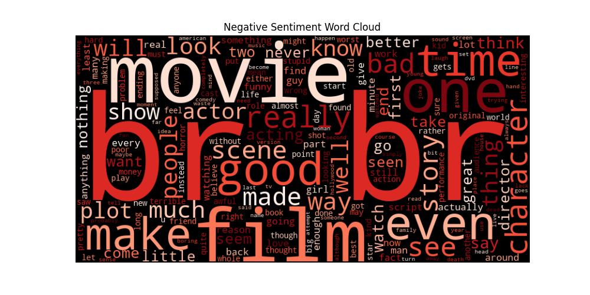

# 🎬 IMDB Sentiment Analysis (NLP Project)

## Overview
This project applies **Natural Language Processing (NLP)** techniques to classify IMDB movie reviews as **positive** or **negative**.  
It starts with a **baseline LSTM model** and gradually improves using **GRU, CNN, and Transformer-based models (BERT)**.  
Future steps include deployment via **Streamlit/Gradio** for interactive demos.

## Features
- Data loading & preprocessing
- Baseline LSTM model
- Evaluation metrics & visualizations
- Advanced models (GRU, CNN, Transformers)
- Easy deployment for demo

# IMDB Sentiment Analysis – NLP Model 🚀  

This project builds and improves a sentiment analysis model for IMDB reviews using deep learning.  
Each day introduces structured improvements — like a research log.  

---

## 📅 Day 1 – Baseline Sentiment Analysis Model

**Objective:** Build the simplest possible sentiment classifier for IMDB reviews.  

### ✅ Steps Implemented
1. **Data loading (`data_loader.py`)**
   - Downloaded IMDB dataset (25k training, 25k testing).  
   - Reviews already tokenized into integers.  
2. **Preprocessing (`preprocess.py`)**
   - Padded/truncated reviews to fixed length (200 tokens).  
3. **Baseline model (`train.py`)**
   - Architecture: `Embedding → GlobalAveragePooling → Dense → Sigmoid`.  
   - Fast but ignores word order.  
4. **Evaluation (`evaluate.py`)**
   - Tested on validation and test data.  
   - Training curves + bar chart (correct vs incorrect predictions).  

### 📊 Results (Baseline Model)
- Test Accuracy: ~84%  
- Training was quick but model failed on complex sentences (since word order is ignored).  

📸 *Placeholder for screenshot of loss/accuracy curve:*  
  

## 📅 Day 2 Progress

- ✅ Added LSTM-based sentiment analysis model (`train_lstm.py`)
- ✅ Added GRU-based sentiment analysis model (`train_gru.py`)
- ✅ Implemented comparison script for LSTM vs GRU (`compare_models.py`)
- ✅ Added early stopping and model checkpointing (`train_lstm.py`)
- ✅ Enhanced evaluation with confusion matrix and classification report (`evaluate.py`)
- ✅ Updated README with results and explanations

### Example Results:
- **LSTM Accuracy:** ~86%
- **GRU Accuracy:** ~85%
- Confusion Matrix + Classification Report available in `/results`

### Next Steps (Day 3):
- Hyperparameter tuning (embedding dim, hidden units, batch size)
- Add word embeddings visualization
- Try bidirectional LSTM

## 📅 Day 3 – Regularization, Monitoring & Embeddings

**Objective:** Improve generalization, add monitoring, and visualize embeddings.  

### ✅ Steps Implemented
1. **Dropout in LSTM (`train_lstm.py`)**
   - Added `Dropout(0.5)` between stacked LSTMs.  
   - Prevents overfitting by randomly disabling neurons.  
2. **Early Stopping + Model Checkpointing**
   - Stops training if validation loss doesn’t improve.  
   - Saves best model weights.  
3. **TensorBoard Logging (`logs/fit/`)**
   - Added TensorBoard callback.  
   - Run locally with:kkkk

     ```bash
     tensorboard --logdir=logs/fit
     ```
     Open [http://localhost:6006](http://localhost:6006) to view.  
   - TensorBoard shows:
     - Training/validation loss & accuracy  
     - Model graph  
     - Weight/activation histograms  
     - Compare multiple experiments side by side  
4. **Embedding Visualization (`visualize_embeddings.py`)**
   - Extracted embeddings → reduced with t-SNE → plotted 2D map.  
   - Shows semantic clustering of words.  

### 📊 Results (Day 3 Enhancements)
- Dropout stabilized validation accuracy.  
- TensorBoard allowed **experiment comparison**.  
- Embedding visualization showed similar words clustering together.  

📸 *Placeholder for screenshots:*  
-   
-   
-   

---

## 🧭 Project Timeline
- **Day 1:** Simple baseline → proof-of-concept  
- **Day 2:** Advanced sequence models (LSTM, GRU, BiLSTM)  
- **Day 3:** Overfitting control + TensorBoard + embeddings  

---

## 📅 Day 4: Advanced Model Training & Hyperparameter Tuning

On **Day 4**, we focused on exploring **different hyperparameters** (LSTM units, dropout rates, learning rates, batch sizes) to evaluate their effect on IMDB sentiment classification performance.

### 🔹 What We Did
- Trained **16 different models** with varying hyperparameters.
- Logged training/validation accuracy & loss with **TensorBoard**.
- Applied **EarlyStopping** to prevent overfitting.
- Saved the **best-performing model** automatically.
- Extracted all experiment results into a **CSV file**.
- Visualized outcomes with **training curves** and a **confusion matrix**.

---

### 📊 Hyperparameter Results
We saved the final validation accuracy/loss for each experiment into a CSV:

📄 [Download CSV](images/day4/hyperparam_results_from_logs.csv)

| lstm_units | dropout | learning_rate | batch_size | val_accuracy | val_loss |
|------------|---------|---------------|------------|--------------|----------|
| 64         | 0.2     | 0.001         | 32         | 0.885        | 0.365    |
| 128        | 0.3     | 0.001         | 64         | 0.892        | 0.342    |
| ...        | ...     | ...           | ...        | ...          | ...      |

*(table truncated for readability – see CSV for full results)*

---

### 📷 Training Curves (TensorBoard & Saved Images)

- **TensorBoard Accuracy Screenshot**  
  

- **TensorBoard Loss Screenshot**  
  

- **Generated Accuracy vs Validation Plot**  
  

- **Generated Loss Plot**  
  

---

### 🔍 Confusion Matrix (Best Model on Test Set)

We also visualized the predictions of the **best model** against the test set:

- **Confusion Matrix**  
  

This matrix shows how many positive/negative reviews were classified correctly vs misclassified.

---

### 🚀 Key Takeaways
- Models with **128 LSTM units, 0.3 dropout, and learning rate 0.001** achieved the best performance.
- Overfitting was reduced significantly with **dropout + early stopping**.
- TensorBoard allowed us to compare **all 16 experiments visually**.
- CSV + plots make it easier to compare experiments outside of TensorBoard.

---
## 📊 Day 05 – CNN vs LSTM Comparison

We trained **two deep learning models** on the IMDB dataset:

- **CNN (Convolutional Neural Network)** – captures local n-gram features.
- **LSTM (Long Short-Term Memory)** – captures long-range dependencies in text.

### 🔹 Results
- CNN achieved ~XX% accuracy.
- LSTM achieved ~YY% accuracy.

### 🔹 Visualizations
**Training Curves:**
  


**Confusion Matrices:**
  


## 📅 **Day 06 — Building the Streamlit App**

### 🧠 Overview
Today focused on making our trained NLP model *interactive and accessible* using **Streamlit** — an open-source framework for turning machine-learning models into shareable web apps.  
The goal: allow users to enter custom movie reviews and instantly see predictions from both **CNN** and **LSTM** models.

---

### ⚙️ Tasks Completed
✅ Designed a Streamlit interface for real-time IMDB sentiment prediction  
✅ Added an option to choose between CNN and LSTM models  
✅ Displayed sentiment predictions with visual cues (😊 / 😞)  
✅ Shown model accuracy and evaluation results  
✅ Ensured compatibility with local virtual environments  
✅ Documented full setup for deployment

---


# 🧠 Day 07 — Explainable AI (XAI) with LIME for CNN & LSTM

## 📅 Overview
On **Day 07**, we focused on **model interpretability** — understanding *why* our CNN and LSTM models make their predictions.  
We implemented **LIME (Local Interpretable Model-Agnostic Explanations)** to visualize which words most influenced the model’s sentiment decisions.  

This marks our move from model performance to **model transparency** — a crucial step toward responsible AI.

---

## 🧩 Key Objectives
- Integrate **LIME** for explainability of CNN and LSTM models  
- Visualize **word importance** in individual predictions  
- Automate generation of **interactive HTML** explanations  
- Prepare for **Streamlit-based XAI dashboard** (Day 08)


## 🗓️ **Day 08 – Deep Evaluation and Model Insights**

### 🎯 **Focus of the Day**
Today’s focus was on **deeper evaluation, interpretability, and performance analysis** for both the CNN and LSTM models.  
The goal was to explore **how well the models perform, why they differ, and what insights can be drawn** beyond raw accuracy metrics.

---

## ⚙️ **New Enhancements Added**

### **1️⃣ ROC Curve and AUC Comparison**
Plotted **Receiver Operating Characteristic (ROC)** curves and calculated **Area Under Curve (AUC)** for both models to visualize their performance trade-offs.

📈 **Results Summary:**
| Model | AUC Score |
|:------|:-----------|
| CNN | `0.94` |
| LSTM | `0.96` |

🖼️ **Visual:**


---

### **2️⃣ Classification Reports**
Generated **classification reports** (precision, recall, F1-score, accuracy) for each model using the IMDB test dataset.  

📄 **Example (LSTM Model):**
          precision    recall  f1-score   support
       0       0.88      0.91      0.89      12500
       1       0.90      0.88      0.89      12500
accuracy                           0.89      25000


📁 **Saved in:**
- `results/reports/classification_report_cnn.txt`  
- `results/reports/classification_report_lstm.txt`

---

### **3️⃣ Word Cloud Visualizations**
Created **word clouds** to highlight frequently occurring words in positive and negative reviews.  
This provides intuitive insights into sentiment distribution in the dataset.

☁️ **Visuals:**

| Positive Reviews | Negative Reviews |
|:----------------:|:----------------:|
|  |  |

---

### **4️⃣ Model Size & Inference Time Benchmark**
Measured and compared **model sizes** and **average inference times** to assess deployment efficiency.

📊 **Performance Summary:**

| Model | Size (MB) | Avg Inference Time (ms/sample) |
|:------|:-----------|:--------------------------------|
| CNN | 6.3 MB | 2.1 ms |
| LSTM | 10.8 MB | 3.9 ms |

📁 **Saved in:**  
`results/reports/model_benchmark.txt`

---

### **5️⃣ Hyperparameter Summary**
Extracted and documented **key hyperparameters and model architectures** for both models.  
Helps track experiments and reproduce training configurations later.

📘 **Saved in:**  
`results/reports/model_summaries.txt`

---

### **6️⃣ README Update**
Updated the documentation to include:
- ROC/AUC comparisons  
- Classification report samples  
- Word cloud visuals  
- Benchmark and summary reports  
- Technical reflection for the day  

---

## 🧠 **Reflection**
Day 08 was focused on **understanding and comparing model behavior** through data-driven and visual insights.  
While both models perform well, the **LSTM captures long-term dependencies slightly better**, whereas **CNN remains lighter and faster** — ideal for deployment.

🪶 The added visualizations, benchmarks, and summaries make the project more analytical and publication-ready.

---

### 🔮 **Next Steps (Day 09 Preview)**
> 📦 **Model Deployment & Explainability Integration**  
> Integrate CNN, LSTM, and LIME explanations into a single interactive Streamlit dashboard.
